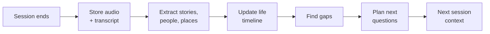

# kataribe 語り部

**A voice AI that talks with an elderly person for a few minutes a day, and turns their memories into a life story their family can read and hear.**

A *kataribe* is a traditional keeper of oral history — the person who remembers the stories and passes them to the next generation. That is the job this does.

---

## Why

Many Japanese seniors spend a lot of time alone, and their families never find the time or the courage to ask about their lives. Having a professional write a 自分史 (self-history) costs upwards of ¥220,000 and happens once.

- **For the senior:** memory work, a sense of purpose, and the knowledge that their story will last.
- **For the family:** stories they never had time to ask about, and a reason to call and ask more.

## How it differs

- **Japanese, zero effort for the senior.** Nothing to install, open, or tap. A tablet on the shelf notices them sitting nearby and asks.
- **Faithful by design.** Every passage links back to the real audio. The AI never speaks for the person and never invents a detail.
- **A family loop, not a companion.** Relatives read new stories and send back questions the AI asks next time. It is a bridge between people, not a replacement for one.
- **Affordable.** A self-history for every family, not a one-off for the few.

## How it works



The device is only a channel. The product is the loop: every conversation becomes structured memory, and that memory plans the next conversation.

## Stack

| Part | Tech |
| --- | --- |
| Kiosk + family view | React, Vite, TypeScript; MediaPipe face detection on-device |
| Voice | Gemini Live API, native audio with built-in transcription |
| Backend | FastAPI (Python 3.13, uv) |
| Processing | Gemini text model — extraction, timeline, gap analysis, question planning |
| Storage | SQLite and local disk for now; Firestore and Cloud Storage when deployed |

## Getting started

Requires [uv](https://docs.astral.sh/uv/), Node 22+, and pnpm.

```bash
make install     # backend + frontend dependencies
make dev         # API on :8000, web on :5173
make check       # lint, types, and tests for both halves
```

Set your Gemini API key before running a conversation:

```bash
cp backend/.env.example backend/.env   # then fill in KATARIBE_GEMINI_API_KEY
```

## Project status

Prototype, built in the open over four weeks. See [docs/plan.md](docs/plan.md) for the full plan and [docs/roadmap.md](docs/roadmap.md) for what is built and what is next.

## Privacy

Face detection runs on the device; no video is ever sent anywhere or stored. Recording starts only after the senior agrees to talk. Stories stay private until the senior says their family may read them.

## License

MIT — see [LICENSE](LICENSE).
