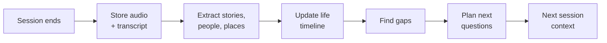
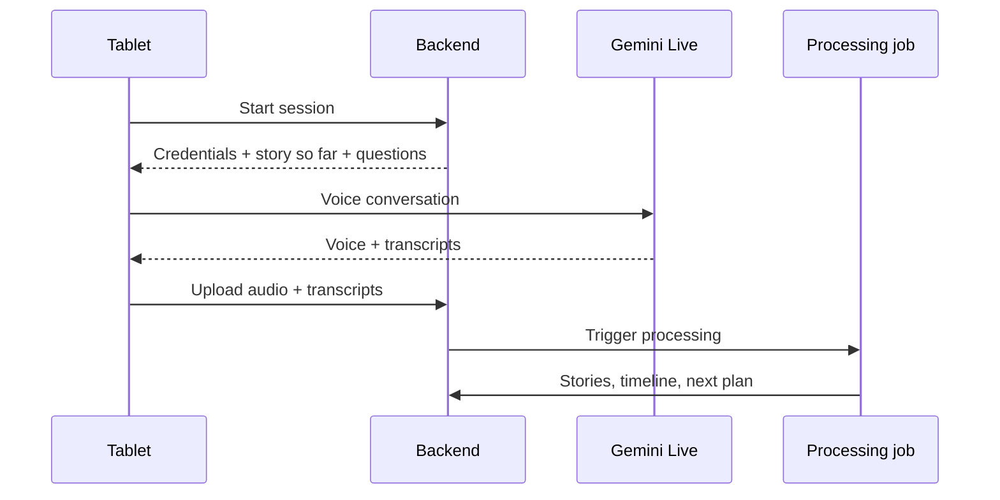

# Life-Story Interviewer: Implementation Plan

Last updated: 2026-09-22

## Overview

A voice AI talks with an elderly person for a few minutes a day and turns their memories into a life story the family can read and hear. The hackathon build runs on a tablet on a shelf; later channels plug into the same backend.

- **Who it's for:** Japanese seniors who spend a lot of time alone, and their families.
- **For the senior:** memory work, a sense of purpose, and the knowledge that their story will last.
- **For the family:** stories they never had time or courage to ask about, and a reason to call and ask more.
- **Hackathon scope:** the tablet channel, the interview brain, and a family view.
- **Out of scope for now:** bilingual output for families, the phone channel, hardware, printed books.

Problem statement fit: supporting communities, on the societal track.

## Positioning

AI memoir interviewers are crowded in English, but no voice-first AI self-history (jibunshi) interviewer for Japanese seniors turned up. The pitch is Japan-specific and family-connected, not "an AI that interviews grandma."

| Product | Where | What it does | Why ours differs |
| --- | --- | --- | --- |
| [Remento](https://resources.remento.co/getting-started/4-minute-overview) | US | Weekly spoken prompts turned into a hardcover book with QR codes to the audio | English; family picks prompts; senior needs a device and a link |
| [Iloomi](https://apps.apple.com/app/id6467228839) | US | Conversational biographer that remembers across stories | English smartphone app |
| [MemoirTalk](https://apps.apple.com/app/id6772472931) | US | Voice companion with a map of life periods covered; family can read along | English iPhone app |
| [EchoMind](https://lablab.ai/submissions/h4rulvuwnisq0vddw32tct30) | Hackathon, June 2026 | Trauma-informed interview, then Gemini agents write chapters and a typeset PDF | Judges may have seen this shape already |
| [親の雑誌](https://oyanozasshi.jp/price/) (Kokoromi) | Japan | Human interviewer writes a printed family magazine, from ¥220,000 incl. tax | Expensive, done by hand, one-off |
| [茶の間 Cotomo](https://thebridge.jp/2024/12/starley-developer-of-voice-ai-chat-app-cotomo-raises-additional-200-million-yen-total-funding-reaches-1-billion-yen) (Starley) | Japan | AI calls an elderly relative daily at a set time; family gets a short report | Companionship, no life story |

Differentiators:

- **Japanese, zero effort for the senior:** nothing to install, open or tap.
- **Faithful by design:** every passage links to the real audio; the AI never speaks for the person.
- **Family loop:** new stories give relatives a reason to call and ask more; the AI is a bridge, not a companion.
- **Affordable:** a self-history for every family, not a ¥220,000 one-off.

## Hackathon channel: the tablet on a shelf

A tablet stands in for the future home device: always on, set up once by family, nothing for the senior to open or tap.

- **Setup:** family installs the web app in kiosk mode (auto-launch, screen always on, plugged in). They enter the senior's name, preferred time of day, and a few seed facts such as birthplace and family names.
- **Presence detection:** on-device face detection (MediaPipe in the browser) notices someone sitting nearby. No video leaves the device or is stored, and nothing records until the senior agrees to talk.
- **Invitation:** at most once a day, near the chosen time, a greeting that recalls the last story and proposes one topic. Example: "Last time you told me about the textile factory. Could you tell me about your first boss?"
- **Backing off:** a "no" or no answer means silence until tomorrow.
- **Session:** 5 to 10 minutes of Gemini Live voice conversation, then a warm close that names a topic for next time.
- **Screen:** large text, the current topic, a clear stop button, and a visible listening indicator.
- **Fallback:** a large "Talk" button in case presence detection misses.

## The brain

The backend turns each conversation into structured memory and plans the next one. This is the real product; the device is only a channel.

Each session runs this loop once, after the conversation ends.

1. **Store:** save the raw audio and Gemini's native input and output transcripts per session.
2. **Extract:** an LLM pass pulls out stories. Each story gets a title, summary, people, places, approximate period, and the senior's own quotes with audio timestamps.
3. **Timeline:** place stories on life stages (childhood, school, work, marriage, children, later life). Approximate dates are fine.
4. **Gaps:** flag life stages with few stories, people mentioned but never described, and stories cut short.
5. **Plan:** rank 3 to 5 follow-up questions by gap size, and keep an avoid list of topics the senior declined.
6. **Context:** the next session's system prompt gets a short "story so far", the planned questions, and the avoid list.

## Family view

A simple web page for invited relatives shows the life story as it grows.

- **Chapters by life stage:** each story shows its summary and the senior's own quotes.
- **Audio everywhere:** every passage links to the original clip.
- **What's new:** stories added since the last visit are highlighted, e.g. "New: her wedding day."
- **Visibility:** only stories the senior agreed to share appear. Hackathon version: private or family; "after I'm gone" comes later.
- **Notifications (later):** a short message when a new story lands, as a prompt to call and ask more.

## Architecture and stack

FastAPI on Cloud Run is the hub; the tablet talks to Gemini Live for voice and to the backend for everything else.

| Component | Tech | Role |
| --- | --- | --- |
| Tablet client | Web app in kiosk mode, MediaPipe face detection | Presence, invitation, mic and speaker |
| Voice | Gemini Live API, native audio with built-in transcription | Real-time Japanese conversation |
| Backend API | FastAPI on Cloud Run | Session start, short-lived Live credentials, uploads, family view API |
| Processing | Cloud Run job triggered at session end, Gemini text model | Extraction, timeline, gaps, question planning |
| Structured data | Firestore | Profiles, stories, timeline, plans |
| Audio | Cloud Storage | Session recordings and story clips |
| Family view | Web page served by the backend | Chapters with audio |

One session end to end; the next session starts from the plan the job wrote.

Model: [gemini-live-2.5-flash-native-audio](https://docs.cloud.google.com/vertex-ai/generative-ai/docs/models/gemini/2-5-flash-live-api) is the generally available option, with affective dialog and automatic language switching. A newer 3.1 Flash Live preview also exists; pick after a Japanese test (see open questions).

## Data model sketch

Six Firestore collections cover the hackathon; audio lives in Cloud Storage and is referenced by path.

| Collection | Key fields |
| --- | --- |
| `seniors/{id}` | name, birth year, birthplace, preferred time, seed facts, family members |
| `sessions/{id}` | seniorId, started/ended at, audio path, transcript, processing status |
| `stories/{id}` | seniorId, title, summary, lifeStage, approxPeriod, people[], places[], quotes[{text, sessionId, startMs, endMs}], visibility, sensitive, versionOf, createdAt |
| `people/{id}` | seniorId, name, relation, storyIds[] |
| `plans/{seniorId}` | storySoFar, nextQuestions[], avoidTopics[], updatedAt |
| `family/{id}` | seniorId, name, email, lastSeenAt |

`versionOf` links a retold story to its earlier telling, so both versions are kept.

## Conversation design and safeguards

The senior leads; the AI listens, remembers and never speaks for them.

- **Follow their lead:** planned questions are invitations. If they drift to another memory, go with it.
- **Difficult memories:** war, loss and old relationships are never pressed. "Let's not talk about that" adds the topic to the avoid list, and it returns only if the senior raises it.
- **Faithfulness:** stories are built from their words, with every passage linked to audio. The AI never invents details. Hiroshima's [testimony device](https://www.city.hiroshima.lg.jp/atomicbomb-peace/fukko/1021099/1042983.html) follows the same rule: it only replays survivors' recorded answers.
- **Changing stories:** never correct them. Keep both tellings, linked to their sessions.
- **Consent to share:** at the end of a story, ask whether the family may read it. Default is private until they say yes.
- **Distress:** if the senior sounds upset, slow down, offer to stop, and end warmly. In the hackathon build, flag the session in the dev view.
- **Limits:** one invitation a day, 5 to 10 minute sessions.
- **Privacy:** face detection stays on the device; family access is by invitation only.

## Future channels

Every channel plugs into the same brain; only the front end changes.

| Channel | When | Notes |
| --- | --- | --- |
| Tablet on a shelf | Hackathon | Kiosk web app with presence detection |
| Phone or landline | After the hackathon | Needs a Japanese number (provider identity and address checks) and conversion of 8 kHz phone audio, which adds latency and may hurt recognition of older voices |
| Smart speaker | Later | Voice only; uses the speaker's own presence sensing where available |
| Companion robot | Vision | Runs inside robots families already buy; asks about the past during the day |

Phone is deferred because setup takes time, audio quality drops, and a live outbound call is awkward to demo.

Pitch line: "Today a tablet on the shelf; tomorrow inside the robots Japanese families already buy; the brain is the same."

## Internal tooling

Translation exists only for the team and the judges, not as a product feature.

- **English dev view:** every transcript, extracted story and chapter shown with an English translation, for debugging and quality checks without reading Japanese.
- **Session inspector:** per session, the context injected, gaps found, questions planned, and any distress flag.
- **Native-speaker review:** a Japanese speaker checks that chapters match what was actually said.
- **Demo subtitles:** English subtitles on the demo video so judges can follow the conversation.

## Build plan

Four weeks to the prototype deadline on 2026-10-18, with a real senior testing from week 2.

| Week | Dates | Milestone |
| --- | --- | --- |
| 1 | Sep 22–28 | Japanese Gemini Live conversation in the browser; FastAPI on Cloud Run issuing credentials; audio and transcripts saved |
| 2 | Sep 29–Oct 5 | Extraction, timeline, gaps and question planning; next-session context working; first session with a real senior |
| 3 | Oct 6–12 | Kiosk mode, presence detection and invitation flow; family view with audio; English dev view |
| 4 | Oct 13–18 | Second real-senior test and fixes; demo video with subtitles; pitch deck |

## Open questions and risks

The biggest unknown is Japanese voice quality with older speakers, so test it in week 1.

Open questions:

- [ ] Which Live model: the GA 2.5 native audio or the 3.1 Flash Live preview? One developer reported a June 2026 [regression](https://github.com/google-gemini/cookbook/issues/1262) where the preview misidentified the spoken language.
- [ ] Check the chosen model's listed discontinuation date and plan a migration path.
- [ ] Which region hosts the Live API, Firestore and Cloud Storage for Japanese seniors' voice data?
- [ ] Who are the one or two seniors for testing, and when is the first session?
- [ ] How do the senior and family give and record consent to recording?
- [ ] Does a tablet web app demo meet the hackathon's submission requirements?

Risks:

- **Crowded category:** lead with Japan, zero effort, faithfulness and the family loop, not the interviewer itself.
- **Seen as an AI companion:** show the family view and the "call her and ask more" moment in the demo.
- **Japanese quality hard to judge in-house:** native-speaker review every week, not just at the end.
- **Scope creep:** phone, printed books, robots and bilingual output stay out until after the deadline.

## Sources

- [親の雑誌 pricing](https://oyanozasshi.jp/price/)
- [茶の間 Cotomo, BRIDGE article](https://thebridge.jp/2024/12/starley-developer-of-voice-ai-chat-app-cotomo-raises-additional-200-million-yen-total-funding-reaches-1-billion-yen)
- [EchoMind hackathon submission](https://lablab.ai/submissions/h4rulvuwnisq0vddw32tct30)
- [Remento overview](https://resources.remento.co/getting-started/4-minute-overview)
- [Iloomi](https://apps.apple.com/app/id6467228839) and [MemoirTalk](https://apps.apple.com/app/id6772472931) App Store pages
- [Hiroshima testimony response device](https://www.city.hiroshima.lg.jp/atomicbomb-peace/fukko/1021099/1042983.html)
- [Gemini 2.5 Flash Live API on Vertex AI](https://docs.cloud.google.com/vertex-ai/generative-ai/docs/models/gemini/2-5-flash-live-api)
- [Live API regression report](https://github.com/google-gemini/cookbook/issues/1262)
